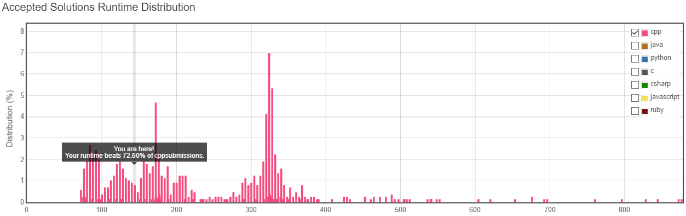

# Note 2016-06-25

tags: Solved BinarySearch

Since the difficulty level is medium, I tried the easiest way broad-first search, obviously failed(TLE).

More efficient way is needed!


## My idea

From the algorithm design aspects, I indeed chose an O(log^2 n) complexity solution!

However, I have   a poor implementation at last.

1. get the depth n of the complete binary tree first, and get a range of the tree nodes numbers 1 << (n-1) ~ (1 << n) - 1;
2. calculate the mid = (left + right) / 2;
3. until left > right, keep check the existence of the node whose id == mid;
4. 3. ends from a search result true, just return whether left or right, otherwise return left - 1 or right - 1;

Then I optimized my method by reducing the bitset processing to bit processing instead.

After all, my runtime cost is shown as below:



## My deficiency

Since == and != have a hight priority than bitwise operations & > ^ > | > && > ||,

We shall write our program like below.

```c++
if( (a<<i) & num != 0)      // erroneous 
    ...

if( ((a<<i) & num) != 0)    // correct
    ...
```


